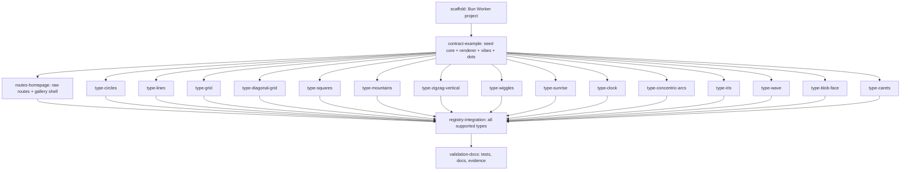

Plan: e-01KWHTGTC3AP26TY4WVFFGAVPM
  Path: .fuel/plans/e-01KWHTGTC3AP26TY4WVFFGAVPM-deterministic-svg-avatars.md (workspace)
  File: /Users/ahf/.fuel/workspaces/ashatars/e-01KWHTGTC3AP26TY4WVFFGAVPM/deterministic-svg-avatars/.fuel/plans/e-01KWHTGTC3AP26TY4WVFFGAVPM-deterministic-svg-avatars.md
  Exists: yes

Plan: e-01KWHTGTC3AP26TY4WVFFGAVPM
  Path: .fuel/plans/e-01KWHTGTC3AP26TY4WVFFGAVPM-deterministic-svg-avatars.md (workspace)
  File: /Users/ahf/.fuel/workspaces/ashatars/e-01KWHTGTC3AP26TY4WVFFGAVPM/deterministic-svg-avatars/.fuel/plans/e-01KWHTGTC3AP26TY4WVFFGAVPM-deterministic-svg-avatars.md
  Exists: yes

Plan: e-01KWHTGTC3AP26TY4WVFFGAVPM
  Path: .fuel/plans/e-01KWHTGTC3AP26TY4WVFFGAVPM-deterministic-svg-avatars.md (workspace)
  File: /Users/ahf/.fuel/workspaces/ashatars/e-01KWHTGTC3AP26TY4WVFFGAVPM/deterministic-svg-avatars/.fuel/plans/e-01KWHTGTC3AP26TY4WVFFGAVPM-deterministic-svg-avatars.md
  Exists: yes

Plan: e-01KWHTGTC3AP26TY4WVFFGAVPM
  Path: .fuel/plans/e-01KWHTGTC3AP26TY4WVFFGAVPM-deterministic-svg-avatars.md (workspace)
  File: /Users/ahf/.fuel/workspaces/ashatars/e-01KWHTGTC3AP26TY4WVFFGAVPM/deterministic-svg-avatars/.fuel/plans/e-01KWHTGTC3AP26TY4WVFFGAVPM-deterministic-svg-avatars.md
  Exists: yes

Plan: e-01KWHTGTC3AP26TY4WVFFGAVPM
  Path: .fuel/plans/e-01KWHTGTC3AP26TY4WVFFGAVPM-deterministic-svg-avatars.md (workspace)
  File: /Users/ahf/.fuel/workspaces/ashatars/e-01KWHTGTC3AP26TY4WVFFGAVPM/deterministic-svg-avatars/.fuel/plans/e-01KWHTGTC3AP26TY4WVFFGAVPM-deterministic-svg-avatars.md
  Exists: yes

Plan: e-01KWHTGTC3AP26TY4WVFFGAVPM
  Path: .fuel/plans/e-01KWHTGTC3AP26TY4WVFFGAVPM-deterministic-svg-avatars.md (workspace)
  File: /Users/ahf/.fuel/workspaces/ashatars/e-01KWHTGTC3AP26TY4WVFFGAVPM/deterministic-svg-avatars/.fuel/plans/e-01KWHTGTC3AP26TY4WVFFGAVPM-deterministic-svg-avatars.md
  Exists: yes

Plan: e-01KWHTGTC3AP26TY4WVFFGAVPM
  Path: .fuel/plans/e-01KWHTGTC3AP26TY4WVFFGAVPM-deterministic-svg-avatars.md (workspace)
  File: /Users/ahf/.fuel/workspaces/ashatars/e-01KWHTGTC3AP26TY4WVFFGAVPM/deterministic-svg-avatars/.fuel/plans/e-01KWHTGTC3AP26TY4WVFFGAVPM-deterministic-svg-avatars.md
  Exists: yes

# Bun Cloudflare SVG Avatar Service

Epic: e-01KWHTGTC3AP26TY4WVFFGAVPM
Type: feature
Primary codebase: c-01KWHT5VSHZKWTCN2F8E6HHD27
Codebase path: /Users/ahf/Code/ashatars
Created: 2026-07-02T16:27:47.459Z
Goal: Build a Bun-managed TypeScript Cloudflare Worker that serves a docs homepage and deterministic SVG avatar routes.

## Remit
Create a brand-new TypeScript project for `ashatars` that runs with Bun locally, deploys to Cloudflare Workers via Wrangler config, and exposes:

- `/`: a basic documentation/gallery website showing generated examples in a clean grid.
- `/:seed.svg`: an SVG avatar route that accepts an email/UUID/string seed plus optional type(s) and vibe, then returns the same SVG for the same normalized inputs every time.

The implementation should port the spirit of `refs/svgs.ex` into TypeScript modules: one generator module per avatar type, a shared deterministic seed/PRNG contract, a shared SVG renderer, centralized vibe/palette handling, and clear exports/docs for supported types/vibes.

## Current Reality
- Repository started brand new. Baseline commit `634a37f Initial ashatar reference baseline` now tracks `.gitignore` and forced `refs/svgs.ex`; `.fuel/` remains untracked.
- Epic checkout was repaired after baseline commit. Ready checkout: `/Users/ahf/.fuel/workspaces/ashatars/e-01KWHTGTC3AP26TY4WVFFGAVPM/deterministic-svg-avatars/ashatars`, branch `fuel/bun-cloudflare-svg-avatar-service`, base `main` at `634a37f8f5ee0751a7365c915eae7b23870b4b40`.
- Local tooling observed: Bun `1.3.14`, Node `v24.16.0`. `wrangler` and `wranglerx` are not globally installed.
- `refs/svgs.ex` defines path generators for: `circles`, `lines`, `grid`, `diagonal_grid`, `squares`, `mountains`, `zigzag_vertical`, `wiggles`, `sunrise`, `clock`, `dots`, `concentric_arcs`, `iris`, `wave`, `blob_face`, `carets`; all assume a 512x512 viewBox.
- The Elixir ref has one global registry/count map at lines 2-19, then each generator mixes geometry and randomness directly. The TS design should separate randomness/contract from type geometry.
- Laravel reference https://avatars.laravel.cloud uses route shape `/{email-or-uuid}?vibe=...`, has vibes such as `sunset`, `ocean`, `daybreak`, `bubble`, `forest`, `fire`, `crystal`, `ice`, `stealth`, and returns PNG. This project should return SVG.
- Cloudflare docs checked 2026-07-02: Wrangler supports project config files, TypeScript Workers are first-class, and custom domains can be configured with `routes` plus `custom_domain = true` in Wrangler config.

## Non-Goals
- No database, durable object, KV, R2, queue, or server-side persistence.
- No app-level caching layer beyond correct HTTP cache headers; Cloudflare edge caching can be configured separately.
- No PNG/JPEG rendering in the first slice.
- No Gravatar/external avatar lookup.
- No auth, admin UI, or paid Cloudflare operations in implementation tasks.
- No live production deploy unless separately requested after review/acceptance.
- No routing library unless route complexity grows beyond `/` and `/:seed.svg`.
- Individual generator tasks should not redesign routing, seed normalization, vibe semantics, or the public API.

## Decisions
- Runtime/package manager MUST be Bun for project scripts and dependency management.
- Hosting target MUST be Cloudflare Workers on the edge.
- Deployment MUST use Wrangler with a committed config file suitable for repeatable deploys.
- Use `wrangler.jsonc` and install `wrangler` as a project dev dependency; no global Wrangler requirement.
- Use raw TypeScript/Cloudflare Worker routing. The Worker should implement a small `fetch()` handler with `new URL(request.url)` dispatch for `/` and `/:seed.svg`, not a routing library.
- Public avatar route MUST be only `/:seed.svg`, e.g. `/ashley@fuel.build.svg?vibe=ocean&type=dots`. Do not add `/avatar/:seed.svg` in this slice.
- Avatar generation MUST be deterministic for the same seed, type selection, and vibe.
- Type-array semantics: `types=a,b,c` or repeated `type=a&type=b` MUST choose exactly one generator deterministically from the provided supported set using the normalized seed/selection context. It MUST NOT layer/combine all types in this slice.
- `type=<name>` selects one generator. No type selects deterministically from all available types.
- Homepage MUST show examples for `ashley@fuel.build` in a grid, with a vibe selector that updates all examples together.
- Avatar type generators SHOULD be split by type/module so visual variants are easy to tweak and can be worked independently.
- Seed normalization/hash/PRNG selection MUST be centralized by the contract/core task, not reimplemented by each generator.
- Vibes MUST be handled outside individual generators: a vibe selects background/gradient and palette roles; generators emit geometry/layers with semantic paint roles.
- Default vibe SHOULD start as `daybreak`; include Laravel-inspired vibes such as `sunset`, `ocean`, `forest`, `fire`, `crystal`, `ice`, `stealth`, and `bubble` unless implementation discovers a better small first set.
- Normalize email seeds with trim + lowercase; preserve UUID/string seeds except trim. Hash normalized input with a Worker-safe deterministic hash and feed a deterministic PRNG such as xoshiro/sfc32.
- SVG response uses `Content-Type: image/svg+xml; charset=utf-8`, `Cache-Control: public, max-age=31536000, immutable`, and CORS `Access-Control-Allow-Origin: *`.
- Invalid vibe/type returns `400` with a small text or JSON error; unknown route returns `404`.

## Generator Contract
The contract task owns exact TS names, but workers should implement this shape:

- Public generator function is pure and receives a prepared context, e.g. `generate(ctx): AvatarLayer[]`.
- `ctx` contains normalized seed info, selected type, selected vibe, `size=512`, and a deterministic RNG whose state is derived centrally from `{seed,type,vibe,version}`.
- Generators MUST NOT call `Math.random`, Web Crypto, Date/time, fetch, env vars, or global mutable counters.
- Generators SHOULD return structured layers/shapes, not full SVG documents. Prefer path/group primitives with semantic paint roles like `primary`, `secondary`, `accent`, `soft`, `contrast`, or explicit `fill="none"`/stroke intent.
- The renderer owns the outer `<svg>`, viewBox, title/desc policy, background gradient/rect, palette role mapping, escaping, attribute validation, and final XML string.
- Generators MAY choose geometry-specific defaults such as stroke width, opacity, fill-vs-stroke, line caps, and blend intent, but SHOULD NOT hardcode vibe colors.
- Type modules should be independently testable with a seeded context and previewable without depending on network or Cloudflare.

## Requirements
- The Worker MUST run without Node-only APIs that are unavailable in Cloudflare Workers.
- The same normalized `{seed, selectedTypePolicy, vibe}` inputs MUST produce byte-stable SVG output across repeated requests and test runs.
- Each supported type MUST render as valid SVG inside `viewBox="0 0 512 512"`.
- The avatar route MUST escape/validate user-controlled text and generated SVG attributes to avoid SVG/script injection.
- The homepage MUST not call external services; preview avatars should be generated through local routes or shared in-process renderer.
- The Wrangler config MUST include a placeholder custom-domain route documented for replacement, not a guessed real domain.
- Tests MUST cover deterministic output, seed normalization, type selection from `types`, invalid params, vibe color separation, and each generator producing valid structured output/SVG.

## Acceptance Criteria
- [ ] `bun install` succeeds and creates a Bun lockfile.
- [ ] `bun test` passes deterministic generator and route tests.
- [ ] `bun run dev` starts local Wrangler dev for the Worker.
- [ ] `/` renders a polished docs/gallery page with examples for `ashley@fuel.build`, about 5 columns on desktop and responsive mobile layout.
- [ ] Homepage includes a vibe selector that changes all gallery examples.
- [ ] Avatar URLs work for email and UUID/string seeds and return SVG, e.g. `/ashley@fuel.build.svg?vibe=ocean&type=dots` and `/7db79f08-6b58-434d-a58d-3309b9eb0975.svg?vibe=ocean&types=dots,lines,wave`.
- [ ] `/avatar/<seed>.svg` is not added as a route in this slice.
- [ ] Same URL returns exactly identical SVG bytes across repeated requests and test runs.
- [ ] `types=a,b,c` chooses one deterministic supported type; it does not layer all requested types.
- [ ] Different seed/type/vibe combinations visibly vary.
- [ ] Supported types from `refs/svgs.ex` are either implemented or explicitly listed as deferred in docs/tests.
- [ ] Wrangler config contains deploy-ready project metadata, compatibility date, main entry, and custom domain placeholder/instructions.
- [ ] Browser/smoke evidence shows homepage and at least several avatar SVG routes render correctly.

## Task DAG
Implementation work should be materialized with `fuel tasks:import --epic e-01KWHTGTC3AP26TY4WVFFGAVPM -` from the ready checkout path.

- `scaffold`: Scaffold Bun + Cloudflare Worker TypeScript project.
- `contract-example`: Implement avatar contract, deterministic seed core, renderer, vibes, and exemplar `dots` type.
- `routes-homepage`: Implement raw Worker routes and gallery homepage against the contract.
- Generator fanout tasks, each depends on `contract-example` and should only add its own type module/tests/preview fixture, avoiding central route/API decisions:
  - `type-circles`
  - `type-lines`
  - `type-grid`
  - `type-diagonal-grid`
  - `type-squares`
  - `type-mountains`
  - `type-zigzag-vertical`
  - `type-wiggles`
  - `type-sunrise`
  - `type-clock`
  - `type-concentric-arcs`
  - `type-iris`
  - `type-wave`
  - `type-blob-face`
  - `type-carets`
- `registry-integration`: Integrate completed type modules into final registry/homepage list.
- `validation-docs`: Finish validation, docs, deploy notes, and evidence.

## Make-Plan-Actionable Notes
- `routes-homepage` and generator tasks can run in parallel after `contract-example` because routes consume the stable registry/render contract, while generators add isolated type modules.
- Individual generator tasks should not all edit the same central registry file. Prefer they add isolated `src/avatar/types/<type>.ts` plus colocated tests/fixtures; `registry-integration` performs the central import/list update once.
- Per-type tasks are intentionally viable so each type can loop on visual quality independently.
- Each generator task should include a self-check that its output is deterministic, valid under the contract, and visually inspected via local preview artifact or screenshot evidence.

## Evidence / Review Checklist
- [ ] `bun --version`, `node --version`, `bun install`, `bun test` outputs captured in closeout.
- [ ] Wrangler local dev smoke result captured for `/` and SVG routes.
- [ ] Browser screenshot of `/` desktop and mobile gallery.
- [ ] Raw header/body evidence for one avatar route showing SVG content type, immutable cache header, and deterministic repeated output/hash.
- [ ] Per-type preview evidence or screenshots for implemented generators.
- [ ] README examples checked against implemented routes.

## Risks / Open Questions
- Custom domain value is still unknown; keep placeholder config/docs until provided.
- `wranglerx` may mean a specific wrapper/tool; no local `wranglerx` binary was found and current Cloudflare docs point to `wrangler`. Use project-local `wrangler` unless user later specifies otherwise.
- Many generator tasks may create merge pressure if they all touch central exports; mitigate with isolated modules and one final registry task.

## Progress Notes
- 2026-07-02: Read `refs/svgs.ex`; confirmed project is otherwise empty/new.
- 2026-07-02: Checked local tool availability: Bun and Node available, Wrangler not globally installed.
- 2026-07-02: Attached epic workspace initially failed because repo had no initial commit/default branch.
- 2026-07-02: Created baseline commit `634a37f Initial ashatar reference baseline` with `.gitignore` and `refs/svgs.ex`; `.fuel/` left untracked.
- 2026-07-02: Repaired workspace checkout at `/Users/ahf/.fuel/workspaces/ashatars/e-01KWHTGTC3AP26TY4WVFFGAVPM/deterministic-svg-avatars/ashatars`.
- 2026-07-02: User confirmed route shape `/:seed.svg` only, `types` chooses one deterministically, and minimal git baseline is OK.
- 2026-07-02: Finalized raw Worker routing decision and test emphasis.

## Get Live
After implementation tasks complete, create a review task. If review passes and the human accepts the epic, use a PR/create or merge get-live step depending on repository policy. Production deploy/custom-domain activation should be a separate explicit action because it can touch live Cloudflare state.
## Change Request: Circle Gallery + Simpler Ref-Inspired Avatars
2026-07-02 user feedback after local preview:
- Homepage previews MUST render as circles, matching the old Heeds-style gallery reference: simple labeled circular thumbnails rather than card-like square previews.
- Homepage controls MUST keep a vibe dropdown and add a refresh button beside it. Refresh MUST generate a random UUID in-browser and update every preview URL to use that seed instead of `ashley@fuel.build`, so all SVGs visibly change together.
- Vibe MUST primarily/only change the avatar background color/gradient. Shape/path colors SHOULD be stable across vibes: default near-black strokes/fills on light/pastel backgrounds; for `stealth` or other dark backgrounds, switch shape/path color to white/near-white for contrast.
- Background vibes SHOULD be semi-light/pastel by default. `stealth` MAY remain dark.
- SVG artwork should feel much closer to `refs/svgs.ex`: simple geometric marks/paths, fewer layers, less decorative detail, less multi-color role usage, and more direct translation of the old Elixir path generator ideas.
- Keep deterministic behavior, `/:seed.svg`, `types` deterministic selection, cache/CORS headers, and tests intact.
## Change Request: Homepage Annotation Polish
2026-07-02 user browser annotations on local homepage:
- Remove the masthead preamble paragraph: "Deterministic SVG avatars for one seed...".
- Make circular avatar thumbnails smaller, roughly half the current displayed size.
- Fix the vibe dropdown/caret visual spacing. Diagnose whether it is due to full-width native select; adjust width/padding/custom select styling so the caret does not look jammed against the right edge.
- Change the avatar gallery into a list where each avatar row includes the circular preview, type label, and the full URL used to generate that avatar next to it.
- Replace the current docs cards with nicer documentation and a URL builder. Builder should allow seed entry, vibe selection, and checkboxes to turn supported SVG types on/off, then show/copy the generated URL using `types=` semantics.
- Preserve the refresh button behavior: random UUID updates all preview URLs and any displayed URL text.
- Preserve `/:seed.svg`, deterministic behavior, circular previews, and no `/avatar` route.

## Change Request: Stealth Default + Builder All-Types Semantics
2026-07-02 user follow-up:
- Default vibe MUST be `stealth` for the homepage and URL builder unless explicitly overridden.
- Avatar API MUST treat missing `type`/`types` as deterministic choice from all supported types.
- URL builder MUST start with no type checkboxes selected. No selected types means omit `type`/`types` and use the all-types default.
- If all supported types are selected, URL builder MUST also omit `type`/`types` because it is equivalent to all-types default.
- Exactly one selected type MUST emit `type=<type>`.
- Multiple selected types that are a proper subset MUST emit `types=a,b,c`.
- Refresh MUST keep builder/generated URLs consistent with the new seed.

## Change Request: Floating Controls + Hide Carets
2026-07-02 user follow-up:
- Homepage vibe selector and refresh/random-seed control MUST remain available while scrolling down the avatar list. Prefer a sticky/floating controls row that feels native on desktop and mobile and does not cover list content.
- Remove `carets` from the homepage avatar list and URL builder checkbox list/docs because user does not like it at the moment.
- Recommended product policy for `carets`: exclude it from public UI/docs and from the no-type/default public pool, but keep direct `type=carets` working as an undocumented experimental type unless implementation reality makes that split unsafe.
- Preserve prior builder semantics for visible/public types: no selected or all selected visible types omits `type`/`types`; one selected emits `type=`; proper subset emits `types=`.
- Validate with browser smoke at the Fuel dev-env URL plus tests/typecheck.

## Change Request: Dots Generator Size + Distribution
2026-07-02 user feedback from screenshot:
- `dots` can render too tiny and too concentrated in the top-left/top band, especially on the dark `stealth` vibe.
- Dots generator MUST increase the effective minimum and maximum dot size so dots are legible at homepage thumbnail size.
- Dots generator MUST use a broader, more centered placement area so dots can occupy the circular avatar more evenly instead of reading as a small top-left grid/starfield.
- Preserve deterministic output for the same seed/type/vibe and keep the simple ref-inspired geometry: circles only, no extra colors/layers.
- Validate with tests and browser/homepage visual smoke, including the `dots` row at thumbnail size.

## Change Request: Circles Partial Visibility
2026-07-02 user feedback from `type=circles&vibe=stealth` URL:
- `circles` can appear empty when it generates one small ring near a square corner that is clipped away by circular display.
- Circles generator MUST generate more than one circle; target 2-7 rings.
- Placement MUST be circle-avatar aware enough that generated rings have meaningful visible portions after circular clipping.
- The full ring does NOT need to fit inside the visible circle; partial edge crops are desired/acceptable. Roughly half-visible is plenty.
- Avoid single-corner specks and near-empty outputs.
- Preserve deterministic behavior and simple circle-only ref-inspired geometry.

## Change Request: Lines Thickness Variety
2026-07-02 user feedback:
- `lines` currently looks too uniform, especially when a site uses only `type=lines` for all users.
- Lines generator MUST introduce more deterministic visual differentiation between seeds, especially through varied line/stroke thickness.
- It SHOULD keep the simple ref-inspired geometric line motif, but may split one path into multiple path segments/shapes so different segments can have different stroke widths.
- For representative seeds, line thicknesses SHOULD visibly vary enough at thumbnail size to distinguish avatars.
- Preserve deterministic output, single-color foreground role, and tests/typecheck.

## Change Request: Dots Count + Sunrise/Squares Thickness Variety
2026-07-02 user feedback:
- `dots` can now allow fewer dots because the dots are less uniform/larger; minimum should be about 3 dots instead of the current high minimum.
- `sunrise` should have more visible line thickness variance.
- `squares` should also have more visible stroke thickness variance, especially for sites using one type repeatedly.
- Preserve deterministic output, simple single-color foreground geometry, and existing homepage/API semantics.
- Bundle these related generator tweaks together because shared generator tests/snapshots are currently centralized.

## Change Request: Static Favicon
2026-07-02 user request:
- Use generated avatar `http://127.0.0.1:41140/8ffc0eb9-1ddb-42ef-aab0-829793ee61d5.svg?type=mountains&vibe=stealth` as the site favicon.
- Download/store the generated SVG in the repo rather than relying on a dynamic favicon URL.
- Add HTML favicon metadata so the homepage uses the stored SVG favicon.
- Because the Worker currently has no static assets pipeline, serving `/favicon.svg` from an explicit Worker route or embedded stored source is acceptable if the SVG content is committed and deterministic.
- Validate `/favicon.svg` and homepage `<head>`.
