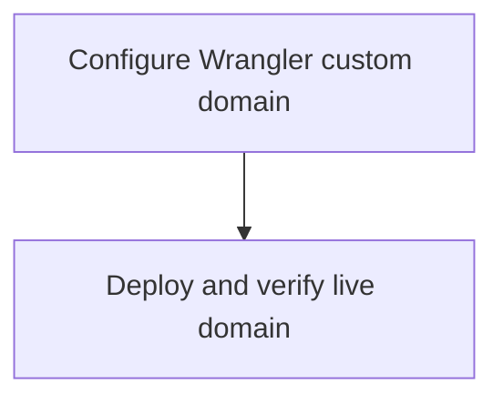

# Deploy avatars.fuel.build

Epic: e-01KWJ5J504EYGHTBTVR6QW91GT
Type: chore
Primary codebase: c-01KWHT5VSHZKWTCN2F8E6HHD27
Codebase path: /Users/ahf/Code/ashatars
Goal: Configure and deploy the Ashatars Cloudflare Worker on `avatars.fuel.build`.

## Remit
Set `avatars.fuel.build` as the Worker custom domain in Wrangler config, deploy with existing local Wrangler credentials, and verify the live custom domain responds with the homepage, SVG avatars, and favicon.

## Current Reality
- Mainline repo is `/Users/ahf/Code/ashatars`; previous epic was accepted and directly merged at `89be6fb`.
- `wrangler.jsonc` declares `{ "pattern": "avatars.fuel.build", "custom_domain": true }`.
- Local Wrangler schema in `node_modules/wrangler/config-schema.json` supports `CustomDomainRoute` with required `pattern` and `custom_domain`.
- Package scripts: `bun test`, `bun run typecheck`, `bun run dev`/`wrangler dev`; Wrangler version in package is `4.107.0`.
- Live deploy is externally stateful; user explicitly requested “get it live too”.

## Non-Goals
- Do not change avatar generation behavior, homepage UX, favicon asset, or API routes beyond config/docs needed for deployment.
- Do not rotate credentials or modify unrelated Cloudflare resources.
- Do not manually edit DNS outside Wrangler/Cloudflare deployment flow unless Wrangler explicitly requires it and the user confirms.

## Decisions
- Domain: `avatars.fuel.build`.
- Use Wrangler config custom domain route: `{ "pattern": "avatars.fuel.build", "custom_domain": true }`.
- Deployment MAY use existing local Cloudflare/Wrangler authentication.
- If authentication, account selection, zone permission, or domain ownership blocks deployment, stop and report exact next action rather than guessing.

## Acceptance Criteria
- [x] `wrangler.jsonc` declares the `avatars.fuel.build` custom domain route.
- [ ] README/deploy notes no longer imply a placeholder domain for the configured production host.
- [x] `bun test` and `bun run typecheck` pass.
- [x] Wrangler deploy completes successfully, or the task reports a precise external blocker.
- [x] Live `https://avatars.fuel.build/` returns the homepage.
- [x] Live `https://avatars.fuel.build/favicon.svg` returns SVG.
- [x] Live deterministic avatar URL returns SVG, for example `/ashley@fuel.build.svg?type=dots&vibe=stealth`.

## Task DAG

## Evidence / Review Checklist
- [ ] Diff of `wrangler.jsonc` and any docs updates.
- [x] Test/typecheck output.
- [x] Wrangler deploy output summary, with secrets redacted.
- [x] HTTP status/header/body snippets for live homepage, favicon, and representative avatar.

## Risks / Open Questions
- Wrangler deploy may require interactive Cloudflare login, account choice, or missing zone permissions for `fuel.build`.
- DNS/custom-domain propagation may take a short time after deploy.
- If Cloudflare treats custom-domain creation as requiring additional account-level confirmation, task should stop and request input.

## Get Live
Deployment is part of this epic because the user explicitly asked to get it live. After deploy verification passes, create/complete review and mark the epic ready for acceptance/done according to Fuel flow.
