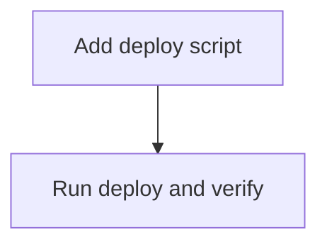

# Add Bun Deploy Command

Epic: e-01KWJ75E92PPYW0R8XXJ5YBCM4
Type: chore
Primary codebase: c-01KWHT5VSHZKWTCN2F8E6HHD27
Codebase path: /Users/ahf/Code/ashatars
Goal: Add a simple Bun deploy command and verify it deploys the live Worker.

## Remit
Add an easy `bun run deploy` script that runs tests, typecheck, and Wrangler deploy, then run it once from main and verify `https://avatars.fuel.build` remains live.

## Current Reality
- Custom-domain epic merged to main at `789ee65`.
- `wrangler.jsonc` now has `routes: [{ pattern: "avatars.fuel.build", custom_domain: true }]`.
- `package.json` scripts currently include `dev`, `test`, and `typecheck`, but no `deploy` script.
- User asked to add the task once merge finishes, then run a fresh deploy.

## Non-Goals
- Do not change app behavior, routes, generators, favicon, or Wrangler domain config.
- Do not change Cloudflare account settings except the normal deploy performed by Wrangler.

## Decisions
- Add `deploy` as `bun test && bun run typecheck && wrangler deploy` so `bun run deploy` gates deploy on tests/typecheck.
- Use existing local Wrangler authentication.
- If deploy fails due auth/permissions/cloud state, report exact blocker.

## Acceptance Criteria
- [ ] `package.json` has a `deploy` script.
- [ ] `bun run deploy` succeeds from mainline checkout.
- [ ] Live homepage, favicon, and representative avatar still return expected responses.
- [ ] No secrets are committed or logged in task notes.

## Task DAG

## Evidence / Review Checklist
- [ ] package.json diff.
- [ ] `bun run deploy` output summary.
- [ ] live curl checks for homepage, favicon, avatar.

## Risks / Open Questions
- Wrangler auth/session may expire. If so, stop with clear login/permission instructions.

## Get Live
This epic includes the deploy run. After verification, review and accept/merge through Fuel as usual.
