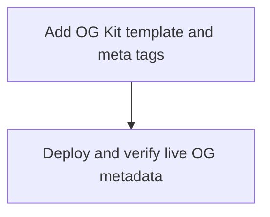

# Add OpenGraph Social Image

Epic: e-01KWJ8FE4FSBVFH7YPDVXZG2E8
Type: chore
Primary codebase: c-01KWHT5VSHZKWTCN2F8E6HHD27
Codebase path: /Users/ahf/Code/ashatars
Goal: Add an OG Kit-powered social image and Open Graph/Twitter metadata for `avatars.fuel.build`.

## Remit
Add a polished social sharing image for Ashatars using OG Kit, add the required Open Graph and Twitter Card metadata to the homepage, deploy the Worker, and verify the live metadata/image URL.

## Current Reality
- Live site is `https://avatars.fuel.build/`.
- `package.json` has `deploy: bun test && bun run typecheck && wrangler deploy` after the deploy-command epic.
- Homepage is rendered in `src/index.ts`; favicon is served from `src/favicon.ts` at `/favicon.svg`.
- Existing app is a single Worker with `/`, `/favicon.svg`, and `/:seed.svg` routes.
- OgKit `/llms.txt` redirected to login during chat discovery, but public `https://ogkit.dev/docs/getting-started` documents the setup:
  - add a `<template data-og-template>` to the page;
  - OG Kit renders templates at 1200x630;
  - add `og:title`, `og:description`, `og:type`, `og:url`, `og:image`, `twitter:card`, `twitter:title`, `twitter:description`, `twitter:image`;
  - image URL shape is `https://ogkit.dev/img/YOUR_API_KEY.jpeg?url={{ urlencode(current_page_url) }}`;
  - optional local preview uses `https://cdn.jsdelivr.net/npm/ogkit@1` and `?ogkit-render`.
- User provided the OG Kit key in the thread. It is intended for use in the public OG Kit image URL according to the docs. Do not print it unnecessarily in task notes beyond required code/config diffs.

## Non-Goals
- Do not change avatar generation behavior, routes, domain config, or deploy script.
- Do not create a backend proxy or Cloudflare secret unless direct OG Kit URL fails.
- Do not add unrelated visual redesign to the homepage.

## Decisions
- Canonical page URL: `https://avatars.fuel.build/`.
- OG title: `Ashatars`.
- OG description: `Deterministic SVG avatars for emails and UUIDs, generated at the edge.`
- OG image URL uses the OG Kit image URL format from docs, with the user-provided key and encoded canonical URL.
- Template should be a polished 1200x630 card: Ashatars name, short value prop, a code-like route sample, and a few circular avatar previews using existing public SVG routes. Keep it inline and self-contained enough for OG Kit.
- Add standard Twitter Card tags with `summary_large_image`.

## Acceptance Criteria
- [x] Homepage `<head>` includes complete OG and Twitter metadata.
- [x] Homepage includes a `<template data-og-template>` suitable for OG Kit rendering at 1200x630.
- [x] The OG Kit image URL responds with an image for `https://avatars.fuel.build/` after deploy, or a precise external OgKit/domain/key blocker is recorded.
- [x] `bun test`, `bun run typecheck`, and `bun run deploy` pass.
- [x] Live homepage source contains the expected metadata and template.
- [x] Live `og:image`/`twitter:image` URLs point at OgKit and use the encoded canonical URL.

## Task DAG

## Evidence / Review Checklist
- [ ] Diff for `src/index.ts` and tests.
- [ ] Test/typecheck output.
- [ ] Deploy output summary.
- [ ] Live homepage head snippets showing OG/Twitter tags.
- [ ] HTTP status/content-type for the OG image URL.
- [ ] Optional local `?ogkit-render` screenshot if provider works.

## Risks / Open Questions
- OG Kit key may be domain-bound; if it is not configured for `avatars.fuel.build`, the image URL may fail until the key/domain is adjusted in OgKit.
- Social card caches may hold old metadata; validation should check raw page source and direct image URL first.

## Get Live
Deployment is part of this epic. After tasks complete, rely on Fuel’s normal review/acceptance flow; do not manually add duplicate review tasks.
